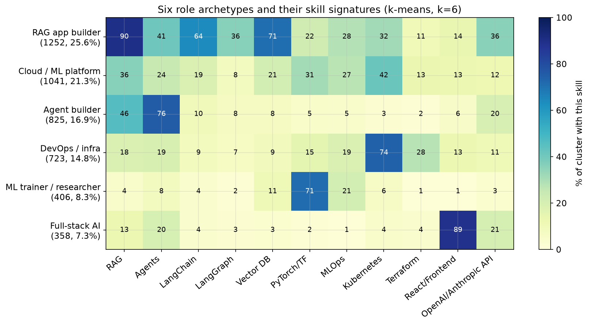

# AI Engineering Job Market Trends

What 4,894 AI engineering job postings tell us about where the role is going, based on six monthly scrapes of builtin.com (Feb 4, 2026 through Jun 25, 2026).

This is the readable summary. Full tables, cluster signatures, methodology, and reproduction steps are in [the appendix](trends-appendix.md). All charts are generated by [_internal/analysis/charts.py](_internal/analysis/charts.py).

A note on the data: there is zero overlap in job IDs between any two scrapes, so each month is an independent cross-section of the market, not a panel of the same postings over time. I can track what the market asks for month to month, but not how long a given role stays open.

## The big shift: integrators are eating trainers

The AI engineer is becoming an integration and orchestration role, not a model-training role. Within ai-first jobs:

- The trainer stack (`PyTorch`, `TensorFlow`, `Fine-Tuning`, `CUDA`) fell from 36.1% to 27.2%
- The integrator stack (`RAG`, agents, LLM APIs, `Function Calling`) rose from 73.6% to 77.9%, peaking at 81.6% in May
- Pure-trainer roles halved, from 12.1% to 5.9%
- Pure-integrator roles became the majority, reaching 60.0% in May

The responsibility verbs confirm it: `train`/`research`/`optimize` fell from 62.3% to 51.5%, while `ship`/`deploy`/`integrate` rose from 76.5% to 79.3%.

## Six role archetypes

I ran spherical k-means on every posting's skill signature and six stable archetypes fell out - I did not define these by hand:

1. RAG app builder - 25.6%. `RAG` + vector databases + `LangChain` + `LangGraph`. The largest archetype.
2. Cloud / ML platform engineer - 21.3%. Multi-cloud, `MLOps`, `PyTorch`/`TensorFlow`, `Kubernetes`.
3. Agent builder - 16.9%. Agents + `Prompt Engineering` + `RAG`.
4. DevOps / infra engineer - 14.8%. `Terraform`, `Kubernetes`, `Docker`, `CI/CD`. Only 52% ai-first.
5. ML trainer / researcher - 8.3%. `PyTorch`/`TensorFlow`. The shrinking archetype.
6. Full-stack AI engineer - 7.3%. `React`/frontend + `Node.js` + LLM APIs.

The traditional ML trainer is now only the fifth-largest archetype. Three of the top four are GenAI-application roles.

## What companies build

- Automation / workflow is the dominant use case and still rising: 59.7% to 70.8%
- Agents / autonomous systems: 44.7% to 52.6%
- `RAG` / Q&A more than doubled: 13.7% to 29.5%
- Search / retrieval: 23.4% to 34.1%
- Classic recommendation / personalization is fading: 16.3% to 7.7%

## SQL is the fastest-rising skill in the field

By slope of monthly share, the risers:

- `SQL`: 9.8% to 34.8% (+3.59 pp per scrape) - the single fastest-rising skill
- `Prompt Engineering`: 32.7% to 47.6% (+2.90)
- `CI/CD`: 29.8% to 37.7% (+1.49)
- `Claude Code` (as a listed skill): 1.7% to 8.2% (+1.25)
- `MCP`: 8.0% to 13.0% (+1.03)
- `LangGraph`: 8.0% to 13.2% (+1.00)

The decliners are the training stack: `PyTorch` (22.0% to 16.4%), `Fine-Tuning` (8.2% to 5.6%), `RLHF` (1.8% to 0.9%). The `SQL` rise tracks the shift from model-training toward data-and-application work - AI engineers are increasingly expected to be data-fluent.

## Two distinct stacks

Skill co-occurrence (lift over baseline) shows two cleanly separated stacks:

The application stack, around `RAG`:

- `RAG` jobs pull in vector databases 51% of the time (x1.9 lift), `Embeddings` (x2.0), `Function Calling` (x2.1), `LangGraph` (x1.8)
- `LangChain` jobs pull in `LangGraph` 42% of the time - the strongest pair in the dataset (x3.1 lift)

The training/infra stack, around `PyTorch`:

- `PyTorch` jobs pull in `MLOps` (x2.0), `Kubernetes` (x1.3), `AWS` (x1.3)

Among jobs using any agent framework, `LangChain` slipped from 88.0% to 83.8% while `LangGraph` rose from 37.7% to 48.5% and `CrewAI` from 15.2% to 24.1%. `LangChain`'s near-monopoly is eroding into a `LangChain`-led, multi-framework world.

## Title predicts the stack

- `ai engineer` (n=1472): 92% ai-first, 61% `RAG`, 43% agents - the canonical RAG-and-agents builder
- `applied` / `forward deployed` (n=387): 93% ai-first, 51% customer-facing - the only majority-customer-facing title group
- `ml engineer` / `scientist` (n=409): 52% `PyTorch`/`TensorFlow` - the one title still rooted in traditional ML
- `platform` / `infra` / `devops` (n=497): only 43% ai-first, 51% `Kubernetes`
- `data engineer` (n=136): 34% ai-first - data work with some AI on top

## Startups build with agents, enterprises still train models

- Early-stage (Seed-Series A) over-index on agents (x1.22) and ai-first (x1.10), and under-index on `PyTorch`/`TensorFlow` (x0.55), `AWS` (x0.60), and `Docker`/`Kubernetes` (x0.59)
- Public / late-stage over-index on `PyTorch`/`TensorFlow` (x1.22), `AWS`, and `Docker`/`Kubernetes`

The training stack survives mainly inside large enterprises.

## The "AI infra engineer" has not actually emerged

Despite the hype around inference and serving, the dedicated AI-infra role is not showing up at scale. Within ai-first jobs, the inference/serving stack (`vLLM`, `Triton`, `TensorRT`, `CUDA`, `Model Deployment`) is 6-11% and declined from 11.4% to 6.4%. Inference work is currently absorbed into the platform/infra archetype rather than forming its own mass role - a useful null finding.

## Eval tooling is migrating from ML to LLM

- Classic MLOps (`MLflow`, `Kubeflow`) declining: 18.5% to 16.8%
- LLM-native eval (`LangSmith`, `Langfuse`, `Guardrails`, `LLM Evaluation`) rising: 9.1% to 12.4%

The tooling is migrating from ML-style experiment tracking to LLM-native evaluation, but overall maturity is still low - most postings name no eval tooling at all.

`MCP` is joining the standard agent stack (8.0% to 13.0%, co-occurring with `LangGraph` and `Function Calling` at x2.5 lift), and AI coding tools became a listed skill: 4.2% to 14.1% overall, roughly one in seven postings.

## Forward Deployed Engineer (FDE) in AI

The FDE is a small but distinct and growing archetype. I found 115 FDE postings (2.3% of the market), rising from a 2.0% share in February to 3.3% in June.

- 97% ai-first
- 92% customer-facing - against 21% for other ai-first roles, a 4x difference
- 50% `RAG`, 50% agents - generalists, not specialists
- Only 15% `PyTorch`/`TensorFlow` (vs 25%) - less research, more delivery

Their use cases cluster around enterprise delivery: automation, workflows, agents, retrieval, and production systems. The FDE is the customer-facing, ship-fast generalist who deploys AI into enterprises.

## The job description is getting fatter

Each posting asks for more than it did four months ago: average total skills per posting rose from 14.9 to 19.5, and GenAI skills from 3.7 to 5.1. The role is accumulating requirements faster than it is specializing.

## Seniority: the missing bottom rung

- Staff and above declining: 18.5% to 13.1%
- Senior holding steady around 33%
- Junior / entry-level essentially nonexistent the entire time, around 1%

Companies hire mid and senior AI engineers; they almost never hire juniors. Entry into the field at the bottom is effectively closed off in the posted market.

For the full monthly tables, cluster signatures, stage-by-stage numbers, methodology, and how to reproduce everything, see [the appendix](trends-appendix.md).
