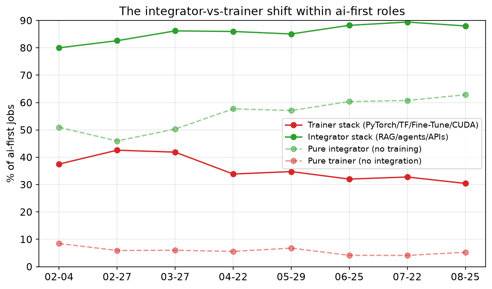
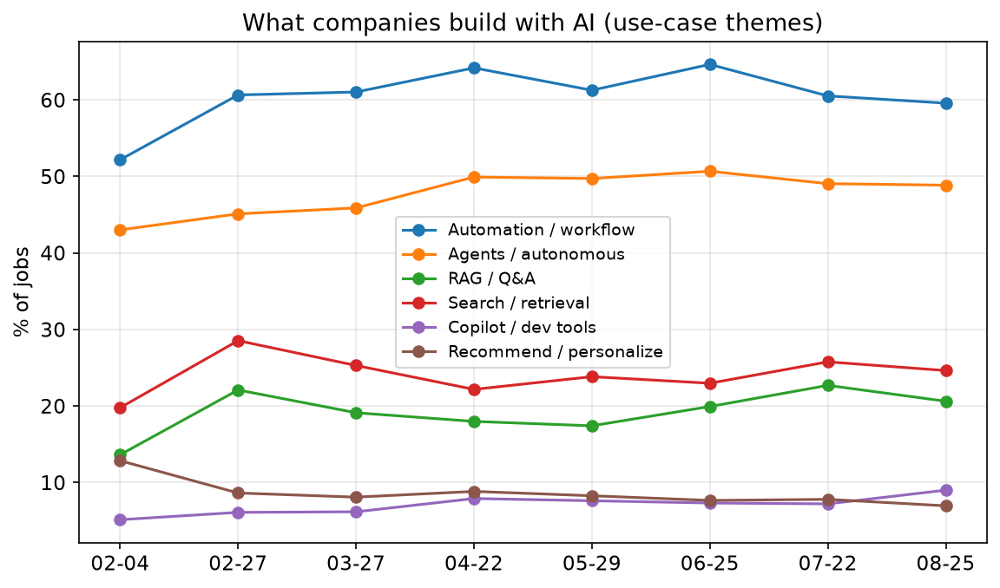
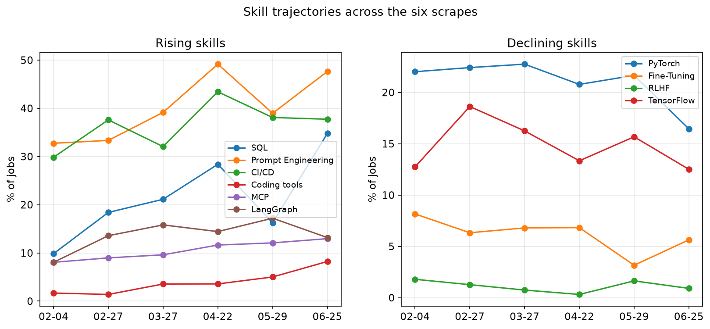
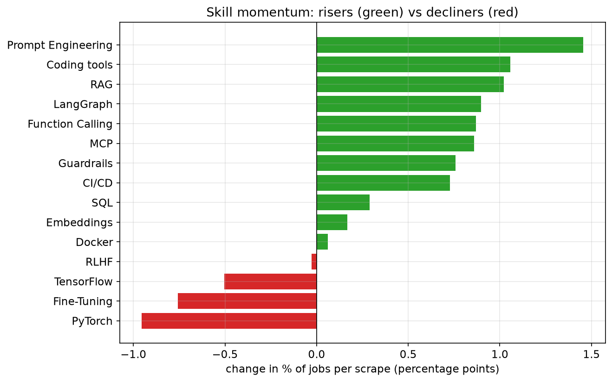

# AI Engineering Job Market Trends

What 6,964 AI engineering job postings tell us about where the role is going, based on eight monthly scrapes of builtin.com (Feb 4, 2026 through Aug 25, 2026).

This is the readable summary. Full tables, cluster signatures, methodology, and reproduction steps are in [the appendix](08-trends-appendix.md). All charts are generated by [_internal/analysis/charts.py](../job-market/_internal/analysis/charts.py).

A note on the data: there is zero overlap in job IDs between any two scrapes, so each month is an independent cross-section of the market, not a panel of the same postings over time. I can track what the market asks for month to month, but not how long a given role stays open.

## Since February: what actually moved

Putting the first scrape (Feb 4) next to the latest (Aug 25) directly:

- ai-first share: 71.5% -> 70.2%, essentially unchanged. The market has held a steady 68-71% ai-first mix the entire eight months - there was no consolidation trend in either direction.
- Within ai-first jobs, the integrator stack (RAG/agents/APIs) rose from 80.0% to 88.0% and the trainer stack (PyTorch/TensorFlow/Fine-Tuning/CUDA) fell from 37.5% to 30.4%. This shift is real and it's the strongest directional signal in the whole dataset.
- RAG-and-agents-together jobs went from 33.1% to 50.5% of ai-first postings - now a majority, up from a third.
- `Prompt Engineering` (26.1% -> 39.0%) and `RAG` (32.8% -> 43.2%) are the fastest-moving named skills.
- Inference/serving work within ai-first roles roughly halved (19.8% -> 9.9%), and `Model Deployment` specifically fell from 18.3% to 6.9%. The dedicated AI-infra role remains far from emerging.
- Staff+ seniority nearly halved as a share of postings (18.5% -> 11.0%), while junior/entry-level stayed pinned at ~1% throughout. The bottom rung of this market has been closed since February; now the top is thinning too.
- Average skill breadth per posting bounced in an 18-23 skill range all year rather than climbing steadily - "the posting is getting fatter" isn't borne out.

## The integrator-vs-trainer shift holds up

Within ai-first jobs, the move from model-training toward integration and orchestration is the strongest directional signal in the dataset:

- The integrator stack rose from 80.0% to 88.0%, peaking at 89.4% in July
- The trainer stack fell from 37.5% to 30.4%
- Pure-integrator roles rose from 50.9% to 62.8% - now well past a majority
- Pure-trainer roles stayed a small minority throughout, 8.4% down to 5.2%

The responsibility verbs point the same direction: `train`/`research`/`optimize` fell in six of the last seven scrapes (64.5% to 45.9%), while `build`/`develop` stayed near-universal (97.3% to 98.0%).

## Five role archetypes

Running the same spherical k-means clustering (k=6, deterministic, seed=7) on the current corpus, k-means initially split agent-building into two clusters that differed almost entirely on whether `Prompt Engineering` was tagged as a skill (97% vs 0% - everything else, including `RAG` and `Agents` share, was close between them). That's a skill-tagging artifact, not a distinct role, so I merged them:

1. Agent builder - 28.6%. `Agents` (88%) + `Prompt Engineering` (51%) + provider APIs. Now the largest archetype.
2. RAG app builder - 25.3%. `RAG` + vector databases + `LangChain` + `LangGraph`.
3. Cloud / ML platform engineer - 18.0%. Multi-cloud, `PyTorch`/`TensorFlow`, `Kubernetes`, inference/serving.
4. DevOps / full-stack engineer - 13.3%. `CI/CD` + `Kubernetes` + `React`/frontend. Only 33% ai-first - the least AI-native cluster.
5. ML trainer / researcher - 8.2%. `PyTorch`/`TensorFlow` + inference/serving. Still the smallest archetype.

The old DevOps/infra and full-stack clusters merged into one since six months ago. Agent-building overtaking RAG-building as the largest archetype, read together with the FDE numbers below, points at agent-style work becoming the default shape of the role rather than a specialization within it.

Note: [images/role-archetypes.png](../job-market/images/role-archetypes.png) still shows the unmerged six-cluster chart - regenerating it needs a change to `_internal/analysis/charts.py`'s cluster-naming logic, not just this doc.

## What companies build

- Automation / workflow is the dominant use case and still rising: 52.2% to 59.6%
- Agents / autonomous systems: 43.0% to 48.9%
- `RAG` / Q&A: 13.6% to 20.6% - up more than half
- Search / retrieval: 19.8% to 24.6%
- Classic recommendation / personalization keeps fading: 12.8% to 7.0%

## Skill trajectories: prompt engineering and RAG lead, not SQL

By slope of monthly share, the risers:

- `Prompt Engineering`: 26.1% to 39.0% (+1.46 pp per scrape) - the fastest-rising named skill
- AI coding tools (`Claude Code`/`Copilot`/`Cursor`): 3.5% to 8.9% (+1.06)
- `RAG`: 32.8% to 43.2% (+1.02)
- `LangGraph`: 7.4% to 17.2% (+0.90)
- `Function Calling`: 9.6% to 14.3% (+0.87)
- `MCP`: 9.9% to 17.6% (+0.86)

The decliners are still the training stack: `PyTorch` (20.8% to 15.3%), `Fine-Tuning` (17.1% to 12.7%), `RLHF` (0.3% to 0.1%).

`SQL` moved from 11.1% to 15.8% over the same period - a real but modest gain, nowhere near the top of the list.

## Two distinct stacks

Skill co-occurrence (lift over baseline) still shows two cleanly separated stacks:

The application stack, around `RAG`:

- `RAG` jobs pull in embeddings 36% of the time (x2.2 lift), vector databases 51% (x2.0), `Function Calling` (x1.9), `LangGraph` (x1.8)
- `LangChain` jobs pull in `LangGraph` 46% of the time - still the strongest pair in the dataset (x3.3 lift)

The training/infra stack, around `PyTorch`:

- `PyTorch` jobs pull in `MLOps` (x2.2), vector databases (x1.4), `Kubernetes` (x1.4)

`MCP` and `Fine-Tuning` both now sit closer to the application stack than the training one - a shift from six months ago, when fine-tuning pulled more heavily toward MLOps and infra.

Among jobs using any agent framework, `LangChain` held roughly flat at 84-86% share while `LangGraph` rose from 37.7% to 61.4% - now used by a majority of framework adopters - and `CrewAI` and `AutoGen` both roughly doubled their share. `LangChain`'s near-monopoly isn't eroding so much as everyone is layering a second framework on top of it.

## Title predicts the stack

- `ai engineer` (n=2,131): 88% ai-first, 56% `RAG`, 68% agents - the canonical RAG-and-agents builder
- `applied` / `forward deployed` (n=587): 91% ai-first, 47% customer-facing - the only title group where customer-facing is common, and by a wide margin (8-16% everywhere else)
- `ml engineer` / `scientist` (n=578): 49% `PyTorch`/`TensorFlow` - the title still most rooted in traditional ML, though now also 45% `RAG`
- `platform` / `infra` / `devops` (n=711): only 47% ai-first, 42% `Kubernetes`
- `data engineer` (n=189): 44% ai-first, 88% Python - data work with AI increasingly layered on top

## Startups lead on fine-tuning now, growth-stage on agents

- Early-stage (Seed-Series A) companies over-index on ai-first (x1.16) and, notably, `Fine-Tuning` (x1.23) - and sharply under-index on `PyTorch`/`TensorFlow`, `AWS`, and `Docker`/`Kubernetes` (all around x0.55-0.60)
- Growth-stage (Series B-F) companies over-index hardest on coding tools (x1.36) and `AWS` (x1.15), while under-indexing on `RAG` and `Fine-Tuning`
- Public/late-stage companies are the only group over-indexing on `RAG` (x1.22)

This pattern shifted from six months ago, when early-stage companies were the ones leaning into agents while avoiding fine-tuning entirely. Now it's growth-stage companies driving the agents-over-training pattern, and early-stage companies are more willing to fine-tune than expected.

## The "AI infra engineer" still hasn't emerged - and the signal is weaker than before

Within ai-first jobs, the inference/serving stack (`vLLM`, `Triton`, `TensorRT`, `CUDA`, `Model Deployment`) fell from 19.8% to 9.9% - roughly half of what it was in February. `Model Deployment` specifically dropped from 18.3% to 6.9%. Meanwhile general `Kubernetes` mentions rose (18.6% to 24.0%). Inference work continues to live inside the platform/infra archetype rather than forming its own mass role.

## Eval tooling is migrating from ML to LLM-native

- Classic MLOps (`MLflow`, `Kubeflow`) declining: 19.9% to 16.9%
- LLM-native eval (`LangSmith`, `Langfuse`, `Guardrails`, `LLM Evaluation`) rising: 26.7% to 30.1%
- `Guardrails` specifically: 10.2% to 15.2%

Most postings still name no dedicated eval tool at all - "LLM Evaluation" as a bare requirement is far more common than any named product. `MCP` continues joining the standard agent stack (9.9% to 17.6%, pulling `Function Calling` and `LangGraph` at 2.3-2.5x lift), and AI coding tools as a listed skill went from 7.6% to 12.8% of postings overall - though that trajectory peaked at 16.2% in June and eased back, so treat it as noisy rather than a clean climb.

## Forward Deployed Engineer (FDE) in AI

The FDE remains a small, distinct, customer-facing archetype: 187 postings (2.7% of the market), rising from 2.0% in February to a peak of 4.4% in July before easing to 2.9% in August.

- 94% ai-first, 89% customer-facing - against 14% for other ai-first roles, a 6x difference
- 72% agents, 47% `RAG` - agent-heavy generalists
- Only 10% `PyTorch`/`TensorFlow` (vs 20% for other ai-first roles) - less research, more delivery

Their use cases cluster around enterprise delivery: automation, workflows, agents, and production systems. The FDE is the customer-facing, ship-fast generalist who deploys AI into enterprises - and the archetype has gotten more agent-centric and less RAG-centric since February.

## The job description didn't actually get fatter

Skill breadth bounced in an 18-23 skill range all eight months without a clear upward trend. GenAI-specific skill count did tick up modestly, 4.6 to 5.5 per posting, but the broader "the role keeps demanding more" story doesn't hold.

## Seniority: the bottom stays closed, and now the top is thinning

- Staff and above declined sharply: 18.5% to 11.0% - the clearest seniority move in the data
- Senior held flat around 30-34%
- Lead roles picked up some of what Staff+ lost: 4.6% to 8.1%
- Junior / entry-level stayed pinned near 1% the entire eight months

Companies hire mid and senior AI engineers overwhelmingly; they almost never hire juniors, and that has not changed since February. What has changed is the top of the ladder - Staff+ postings have nearly halved as a share of the market.

For the full monthly tables, cluster signatures, stage-by-stage numbers, methodology, and how to reproduce everything, see [the appendix](08-trends-appendix.md).
